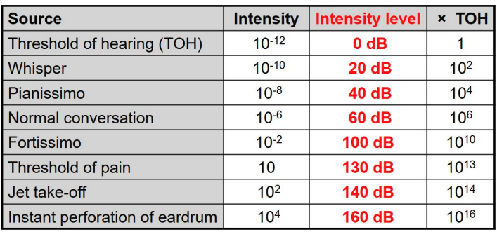
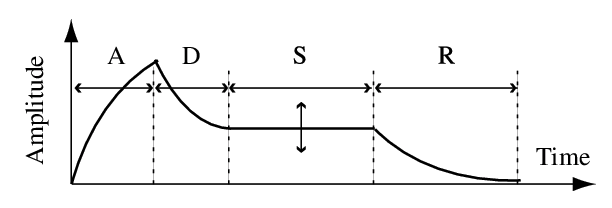
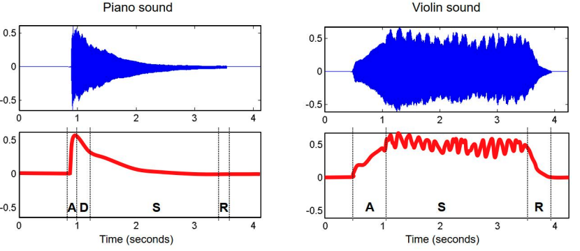
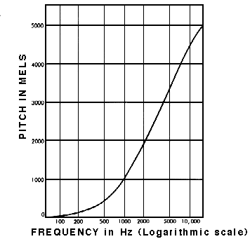
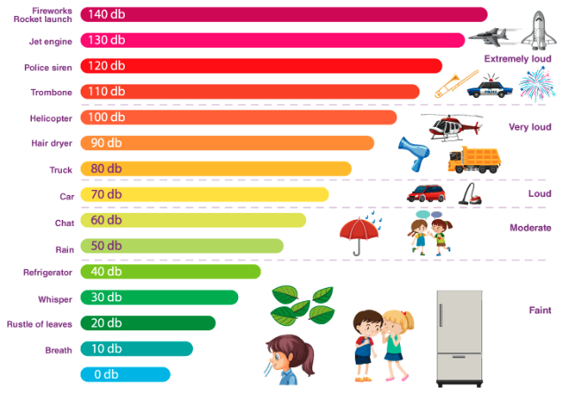
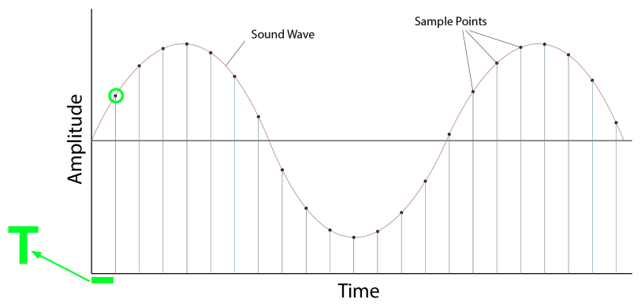
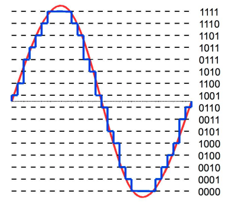
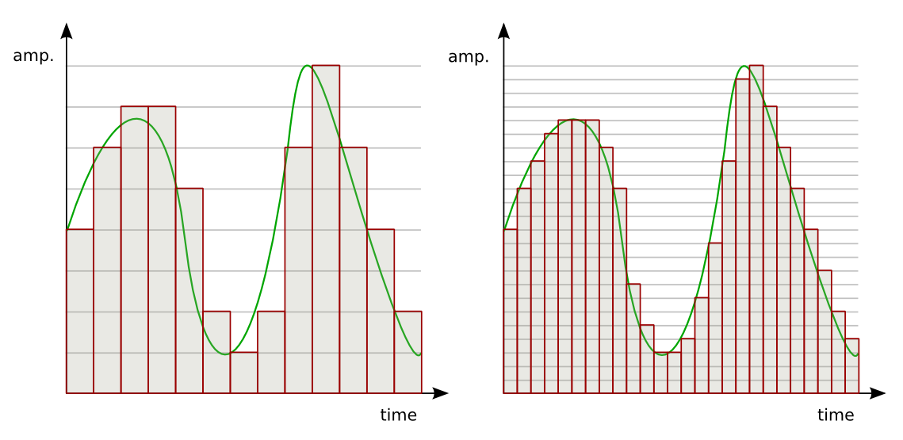

# Audio Processing

## Sound Power, Intensity, Loudness, and Timbre

### Power

- Rate at which energy is transferred
- Energy per unit of time emitted by a sound source in all directions
- Measured in watt (W)

### Intensity

- Sound power per unit area
- Measured in $W/m^2$
- **Threshold of hearing (TOH)** - minimum intensities that human can perceive sounds: $TOH = 10^{-2} W/m^2$
- **Threshold of pain (TOP)**: $TOH = 10 W/m^2$

#### Intensity Level

- Ratio between two intensity values (usually using **TOH** as reference)
$$dB(I) = 10*log_{10}{(\frac{I}{I_{TOH}})}$$

  

### Loudness

- Subjective perception of sound intensity
- Depends on duration / frequency of a sound
- Depends on age
- Measured in `phons`

### Timbre

- Difference between two sounds with same **intensity**, **frequency**, and **duration**
- Colour of sound: described with words like bright, dark, dull, harsh, warm

#### Features of Timbre

- Timbre is multidimensional
- Sound envelope: important feature to determine the sound
- Harmonic content
- Amplitude / frequency modulation

##### Sound Envelope

- Sound Envelope is implemented based on the **Attack-Decay-Sustain-Release** Model

  

- Example:

  

##### Harmonic content

- Complex sound is Superposition of sinusoids
- A `partial` is a sinusoid used to describe a sound
- The lowest partial is called `fundamental frequency`
- A `harmonic partial` is a frequency that’s a multiple of the fundamental frequency
  - For example: fundamental frequency is $f_1=440$, then the $f_2=2*440$, $f_3=3*440$ are `harmonic partial`
- `Inharmonicity` indicates a deviation from a harmonic partial

## How do humans hear Frequencies?

- The way we hear frequencies in sound is known as `‘pitch’`.
- A **high-pitched** sound has a **higher** frequency than a low-pitched sound.
- Humans do **not perceive** frequencies **linearly**.
  - For instance, if you listened to different pairs of sound as follows:
    - 100Hz and 200Hz
    - 1000Hz and 1100Hz
    - 10000Hz and 10100 Hz
  - The actual frequency difference between each pair is exactly the same at 100 Hz.
  - However,the pair at 100Hz and 200Hz will sound further apart than the pair at 1000Hz and 1100Hz.
    - And you will hardly be able to distinguish between the pair at 10000Hz and 10100Hz.
  - Reason: if we realize that the 200Hz frequency is actually double the 100Hz, whereas the 10100Hz frequency is only 1% higher than the 10000Hz frequency.
  - We hear them on a **logarithmic** scale rather than a linear scale.

### Pitch vs Frequency

- Formula:
  $$F(p)= 2^{\frac {p-69}{12}} *440$$

### Mel Scale

- The Mel Scale was developed to take this into account by conducting experiments with a large number of listeners.
- It is a scale of pitches, such that each unit is judged by listeners to be equal in pitch distance from the next.

   
Mel Scale measures human perception of pitch

## How do humans hear Amplitudes?

- The human perception of the amplitude of a sound is its loudness.
- And similar to frequency, we hear **loudness logarithmically** rather than linearly.

### Decibel Scale

- On this scale, 0 dB is total silence. From there, measurement units increase exponentially.
- 10 dB is 10 times louder than 0 dB,
- 20 dB is 100 times louder
- 30 dB is 1000 times louder.
- Above 100 dB starts to become unbearably loud.

   
Decibel levels of common sounds

## Audio Signals

- Representation of sound

### Analog vs Digital Signals

- Audio Signals:
  - Continuous values for time
  - Continuous values for amplitude
- Digital Signals:
  - Sequence of discrete values
  - Data points can only take on a finite number of values

### Analog to Digital Conversion (ADC)

- Sampling
- Quantization

#### Sampling

- Sampling Period (s): $T$
- **Sampling Rate** (number of samples per second) (Hz): $\frac{1}{T}$
  

    
  

#### Quatization

- Quantizing on the amplitude (y-axis)
  

    
  

- `Bit-depth`: how many possible values those amplitude measurements for each sample can take.

- For example, a bit-depth of 16 means that the amplitude number can be between 0 and 65535 ($2^{16}— 1$)

   
Bit-depth and sample-rate determine the audio resolution

