# Audio Features

- Build intelligent audio systems

## Audio feature categorisation

There are couple of ways to catergorise audio features:

- Level of Abstraction
- Temporal Scope
- Music Aspect
- Signal Domain
- ML Approach

### Level of Abstraction

- High-level:
  - Example: instrumentation, key, chords, melody, rhythm, tempo, lyrics, genre, mood
- Mid-level:
  - Example: pitch- and beat-related descriptors such as note onsets, fluctuation patterns, MFCCs
- Low-level: features that make sense for the machine, but not for humans
  - Example: amplitude envelope, energy, spectral centroid, spectral flux, zero-crossing rate

### Temporal Scope

- Instantaneous (~50ms) feature
- Segment-level (seconds) feature:
- Global feature

### Music Aspect

- Beat
- Timbre
- Pitch
- Harmony

### Signal Domain

- Time Domain
- Frequency Domain: take the raw audio from time-domain & apply Fourier Transform on the raw audio to get the spectrum
  - Type of Spectrum: Spectrogram,Mel-spectrogram, Constant-Q transform
  - X-axis: Frequency
  - Y-axis: Magnitude

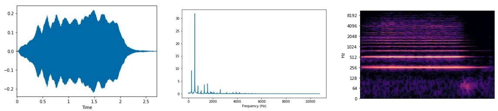 Time-frequency representations

### ML Approach

- Traditional machine learning
- Deep learning

## Audio Feature Extraction Pipeline

### Time-domain Audio Feature Extraction Pipeline

- Step 1: ADC: need to sample & quantise the analog sound to get the digital signal
- Step 2: Framing
  - Frame 1: from sample 1 to sample 128
  - Frame 2: from sample 64 to sample 192
  - Note: there are the **overlapped** samples among Frames

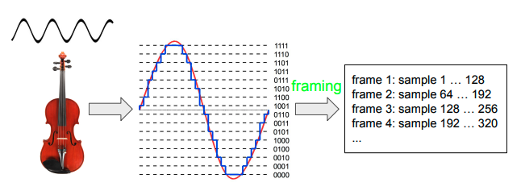

- Step 3: Aggregate the feature &#8594; obtain the feature vector

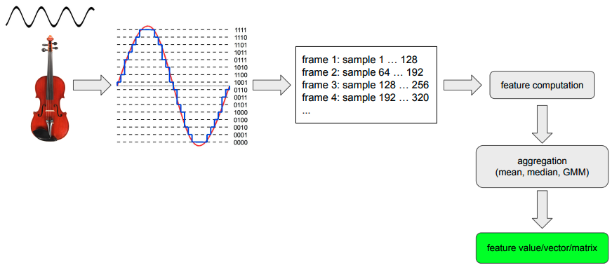

#### Why needs Framing ?

- Perceivable audio chunk
  - For example: 1 sample @44.1KHz = 0.0227 ms &#8594; The duration of 1 sampel << Ear's time resolution &#8594; People cannot perceive a single sample
- "Power of 2" number of samples speed up the process of Fourier Transforms
- Duration of Frame $d_f$ forumla
  $$ d_f = \frac {1}{s_r} K$$

  - Where
    - $\frac {1}{s_r}$ duration of a sample
    - $K$ is number of samples per frame, usually 256 to 8192

##### Hop Length

- `hop_length` is the distance between 2 frames
- For non-overlapping frame, `hop_length = FRAME_SIZE`
- For overlapping frame, `hop_length < FRAME_SIZE`

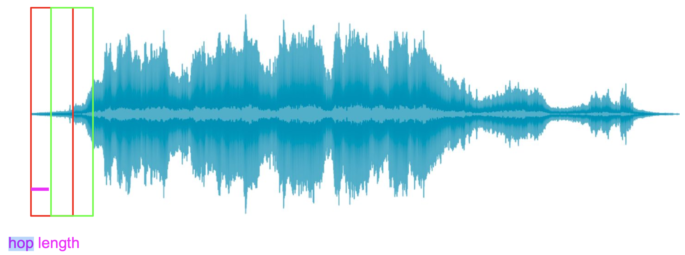

### Frequency-domain Audio Feature Extraction Pipeline

- ADC (sampling and quantising) &#8594; framing &#8594; windowing (to avoid spectral leakage) &#8594; FT &#8594; Feature Computation

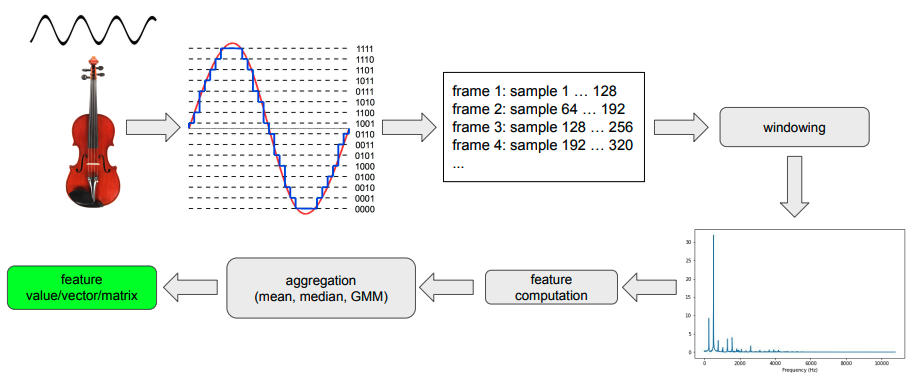

## Time Domain Audio Features

### Amplitude Envelope

- Amplitude Envelope: max amplitude value of all samples in a frame
- Gives rough idea of loudness
- Sensitive to outliers
- Application: Onset detection, music genre classification
- Forumla:
  - where $s(k)$ is the amplitude of kth sample
  - $K$ is number of samples per frame, usually 256 to 8192

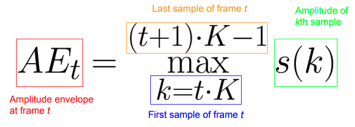

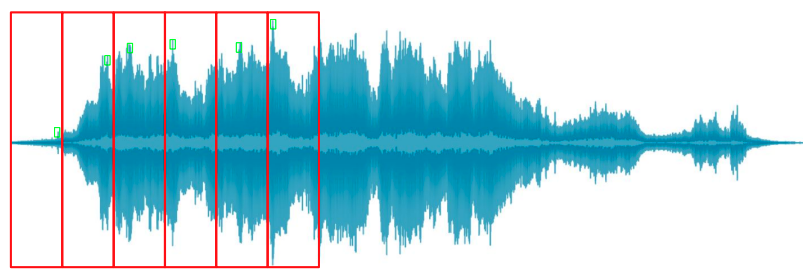 Green dots are maximum amplitudes in each frame

### Root-Mean-Square (RMS) Energy

- RMS of all samples in a frame
- Indicator of loudness
- Less sensitive to outliers than AE (as get the information from all samples in the frame)
- Application: Audio segmentation, music genre classification
- Forumla: where $s(k)$ is the amplitude of kth sample

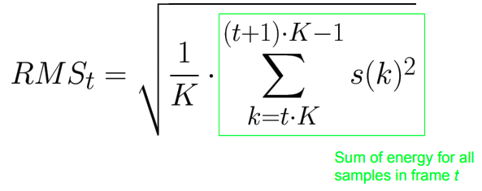

### Zero Crossing Rate

- Number of times a signal crosses the horizontal axis

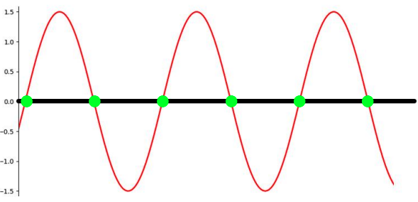

- Application: Recognition of percussive vs pitched sounds, Monophonic pitch estimation, Voice/unvoiced decision for speech signals
- Forumla:
  - If one side is -1, and the other side is 1, so $|-1-1|=2$

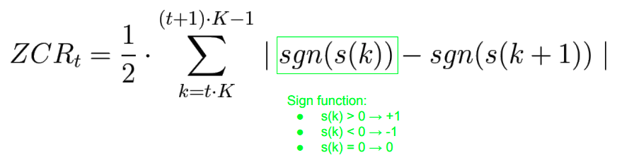 
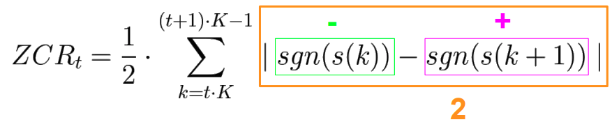

