# Fourier Transform

## Intuition

- The need to decompose a complex sound into its frequency components.
- Compare signal with sinusoids of various frequencies
  - For each frequency we get a magnitude and a phase

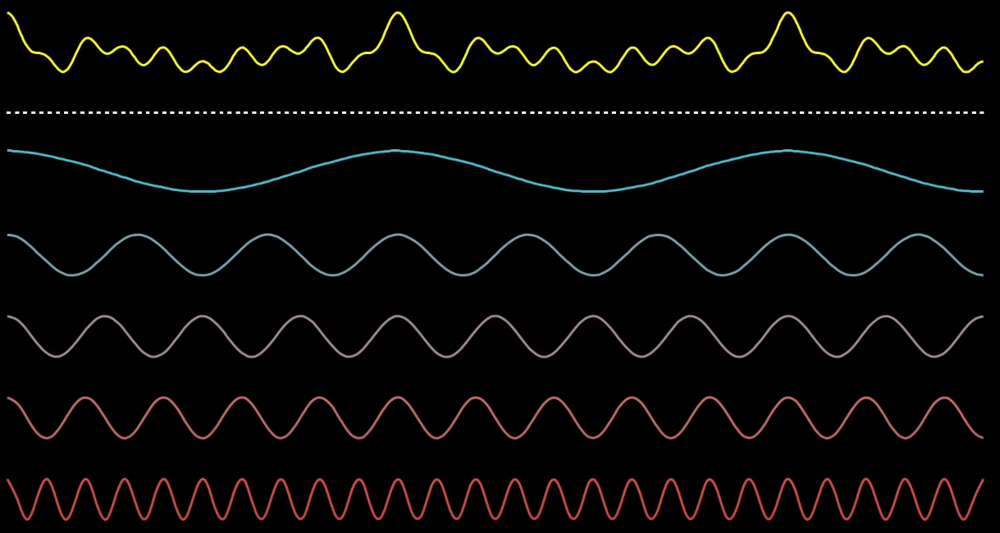

- Example 1: a sine wave is represented in the both time and frequency domain.
  - In time-domain, the signal has variation in amplitude over time
    - 1 cycle per 20 msec is equivalent to a 50Hz frequency signal.
  - In frequency domain, the signal has variation in amplitude over frequency
    - As there is only one sine wave, in the frequency domain the signal has a peak at 50Hz, and the rest are approximately zero.

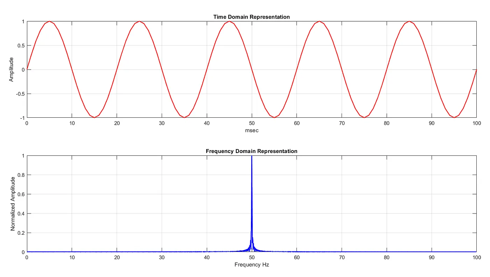

- Example 2: Two different sine waves (dotted lines) added together to create a third wave (solid red line)
  - In frequency domain, there are two peaks for two different sine waves. The peak at 10 and 50 Hz has a normalized amplitude of unity and 0.5 respectively.

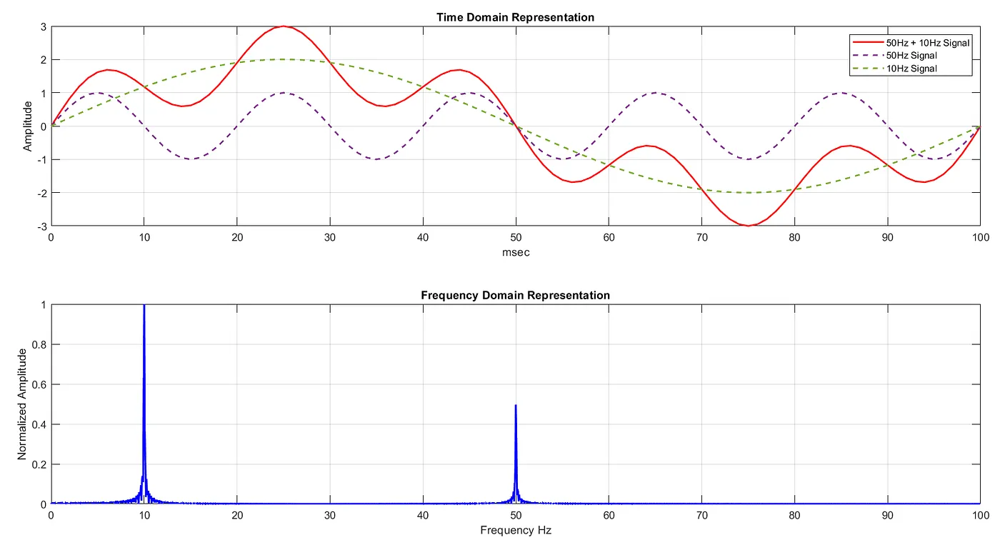

## Complex Number

- Fourier transform requires magnitude and phase
- Something with magnitude + phase &#8594; Complex Number
- Forumla:
  $$ c = a + ib$$
  - where
    - $a$ Real part
    - $ib$ Imaginary part
    - $i = \sqrt -1$

### Polar Coordinate Representation

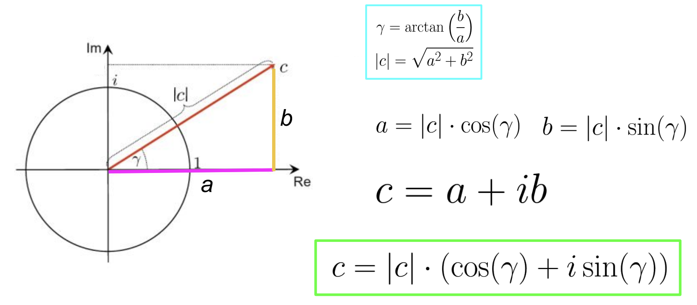

### Euler's formula

- Euler's formula:
$$e^{i\gamma} = cos(\gamma) + i*sin(\gamma)$$

- Replace $\gamma=\pi$, we have $e^{i\pi} = cos(\pi) + i*sin(\pi) = -1$
  &#8594; Euler's Identity
  $$e^{i\pi} + 1 = 0$$

### Polar Coordinate 2.0

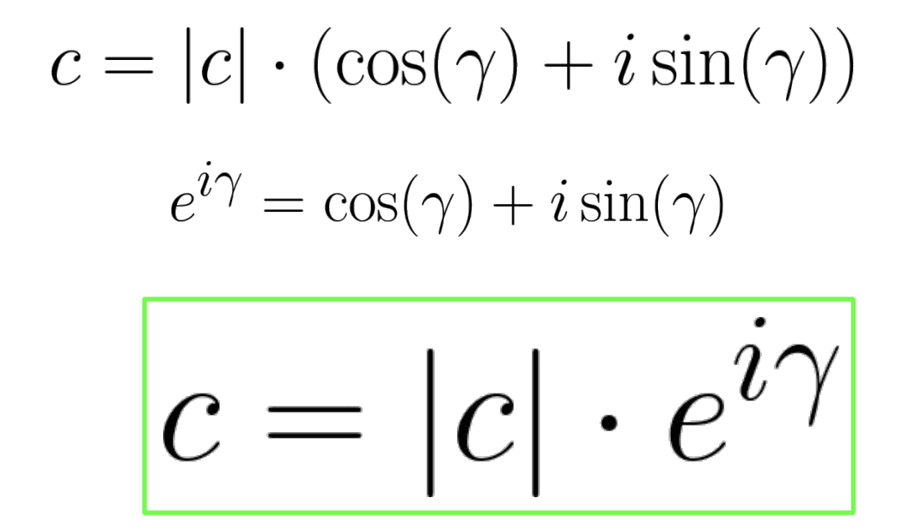

- Where:
  - $|c|$ represents the scales distance from origin
  - $e^{i\gamma}$ represents the direction of a number in the complex plane

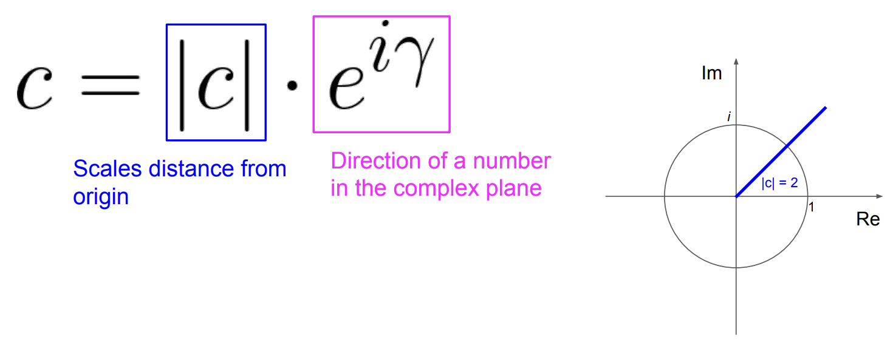

## Fourier Transform

- Compare signal with sinusoids of various frequencies
- To find the $phase$, we multiply the signal with sinusoid and then calculate the area. The phase will be the value that can return the maximum calculated area

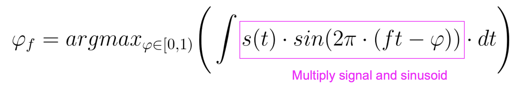

- The $magnitude$ will be the maxinum area
  - High magnitude indicates high similarity between the signal and a sinusoid

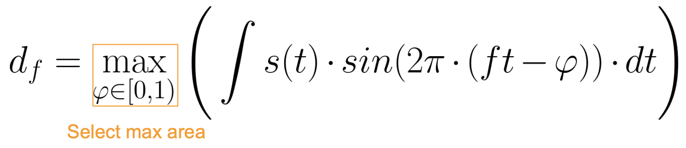

- For example, the signal (blue) is multiplied with the sinusoid wave with the same frequency and phase, resulting the positive shaded area
  - the +ve vol (phase of sin = 0.55): both sin signal with orignal signal have the same sign
  - the -ve vol (phase of sin = 0): both sin signal with orignal signal have diff phase
  - mix (+ve -ve) (phase of sin = 0.4)
  

  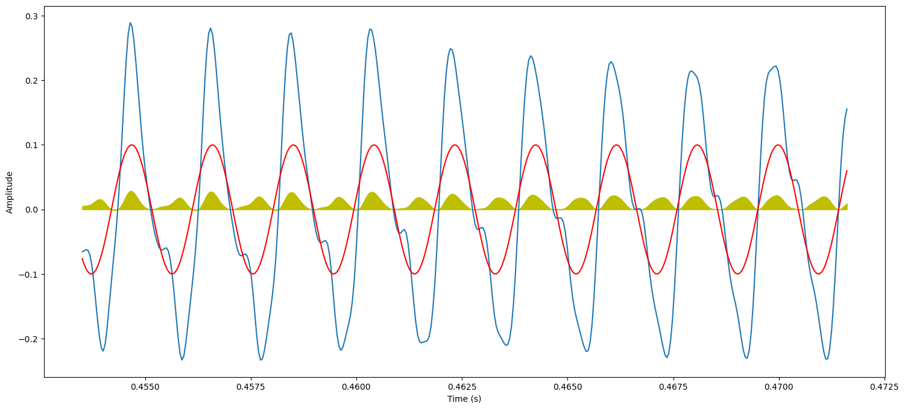
  

### Complex Fourier Transform Coefficients

- Complex Fourier Transform Coefficients is a combination of phase and magnitude $d_f$
  - Note: When we increase the phase, `-1` helps to rotate in the clock-wise direction

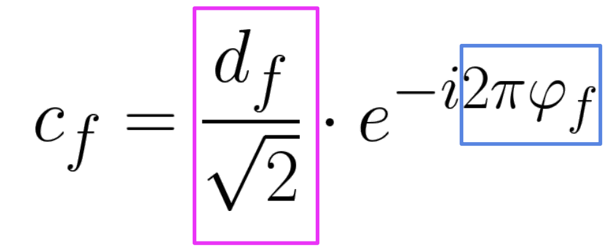

### Complex Fourier Transform

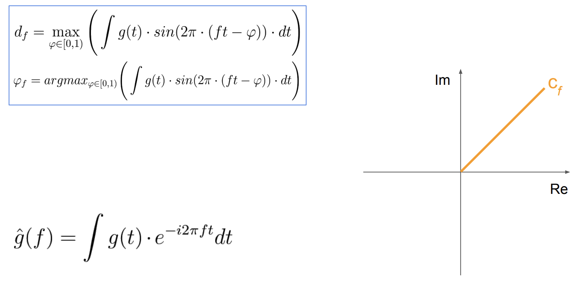
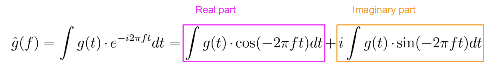

### Inverse Fourier transform

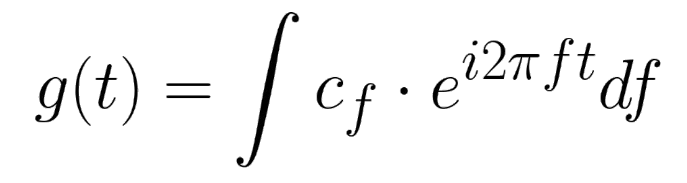

- Example:

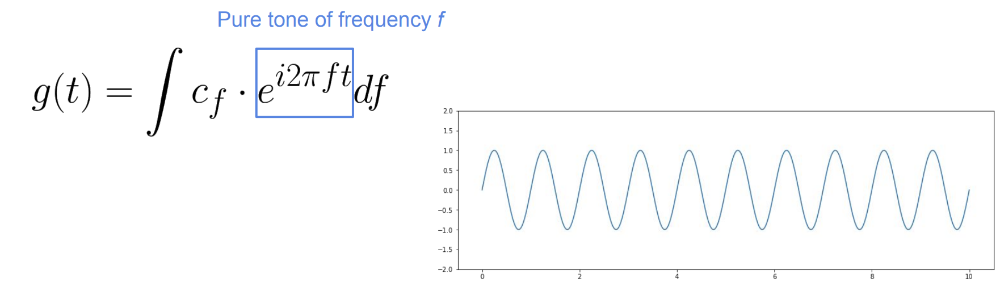
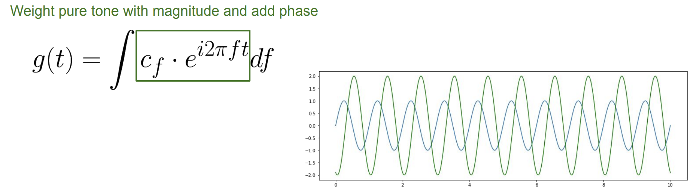
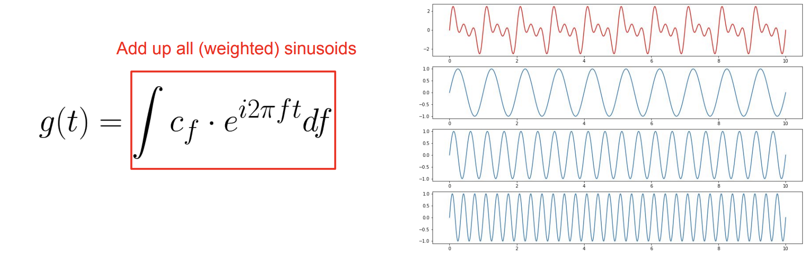

## Discrete Fourier Transform (DFT)

- In continuos case $g(t)$, we use the integral to integrate over time $dt$
- In discrete case (samples) $x(n)$, we use sum

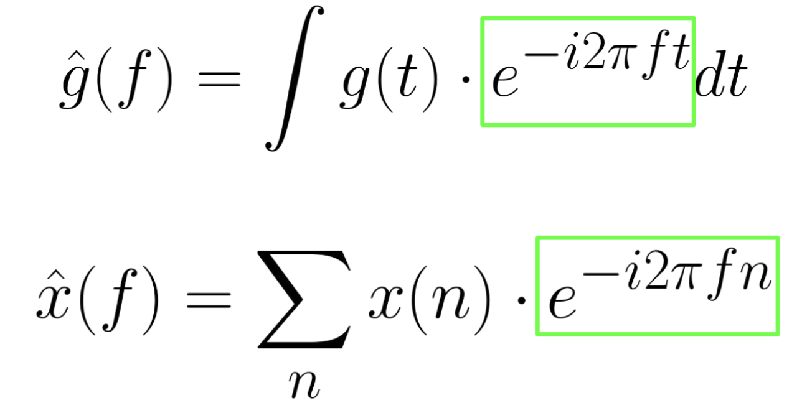

## Short-Time Fourier Transform (STFT)

- **STFT**: consider small segments of the signal, and apply FTT locally

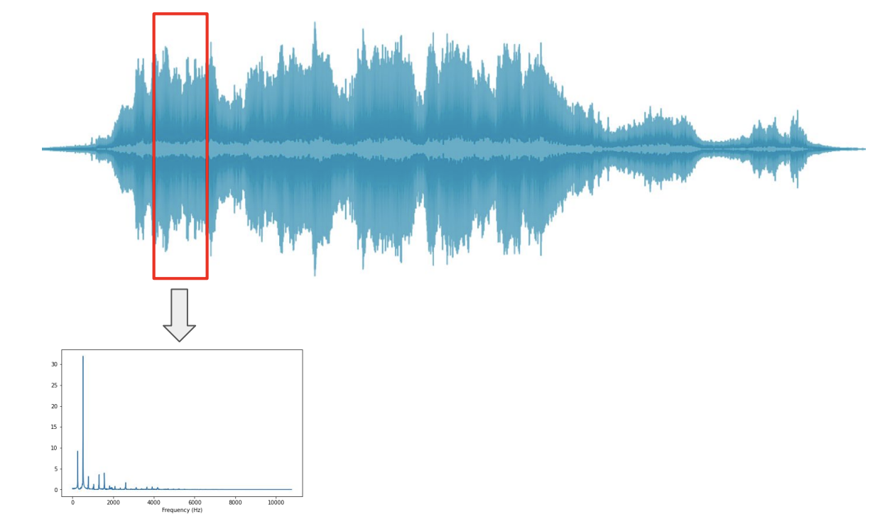

- Windowing: Apply windowing function $w(k)$ to signal $x(k)$

  - Usually, `window_size = frame_size`
  - If `window_size != frame_size`, a padding will be applied.
  $$x_w(k) = x(k)*w(k)$$
  

  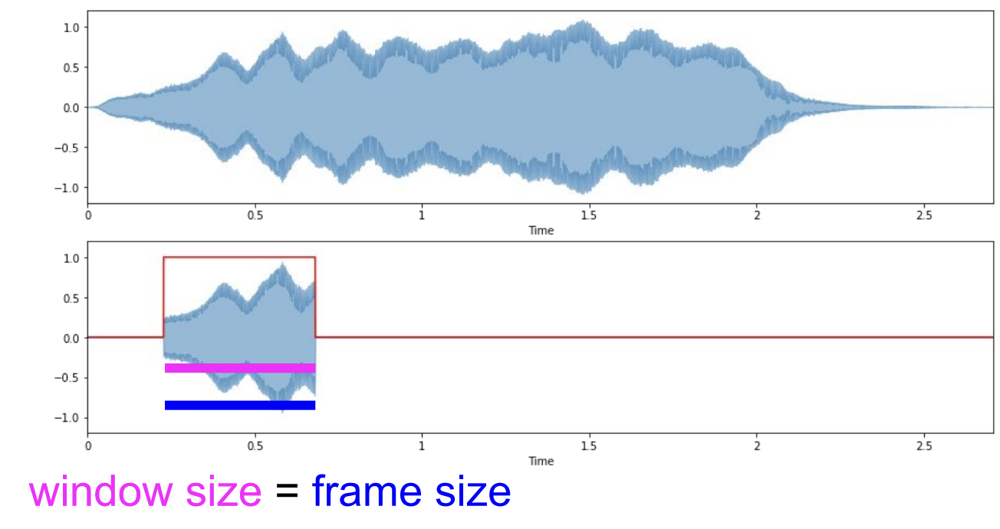
  

- Hop size ($H$): to get the overlaping frame
  

  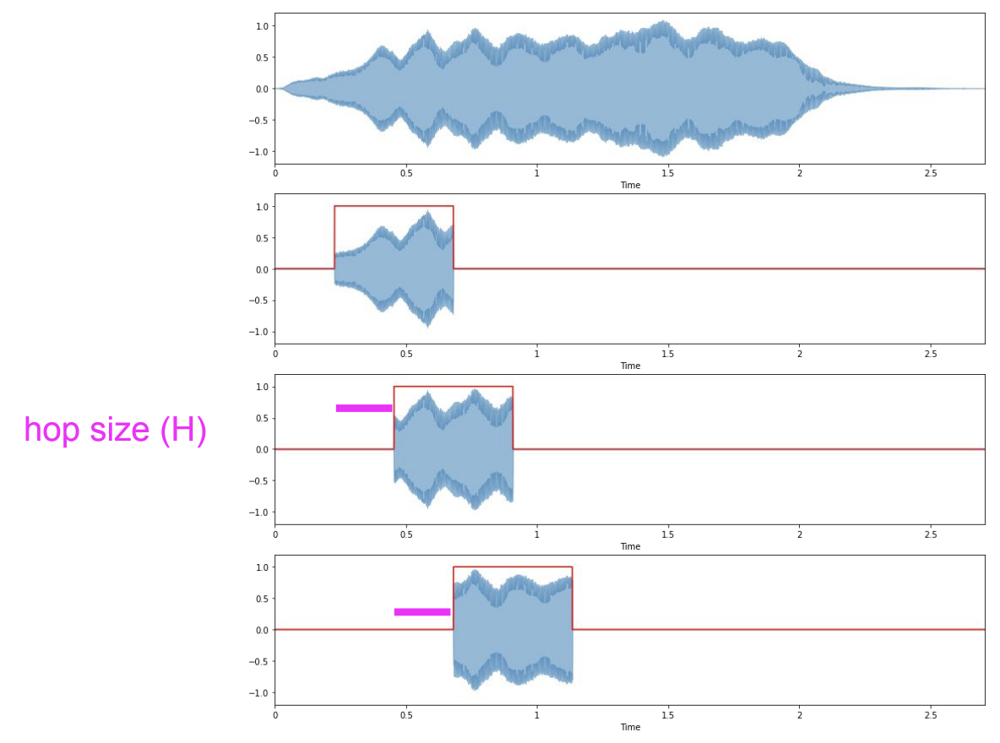
  

- $m$: frame number
- STFT Formula $S(m,k)$:
  

  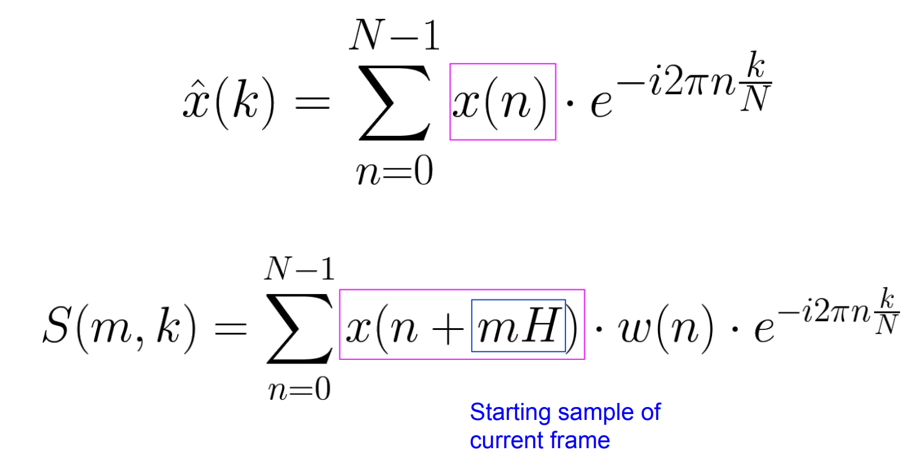
  

- Output of DFT vs STFT:
  - DFT:
    - Spectral vector (# frequency bins)
    - N complex Fourier coefficients
  - STFT:
    - Spectral matrix (**# frequency bins**, **# frames**)
    - Complex Fourier coefficients
- STFT Output Calculation
  - No. of frequency bins $ = \frac {frame size}{2} + 1 $
  - No. of frames $ = \frac {samples - frame size}{hopsize} + 1$
  - Example: Signal = 10K samples, Frame size = 1000, Hop size = 500
    - No. of frequency bins = 1000 / 2 + 1 = 501
    - No. of frames = (10000 - 1000) / 500 + 1 = 19
