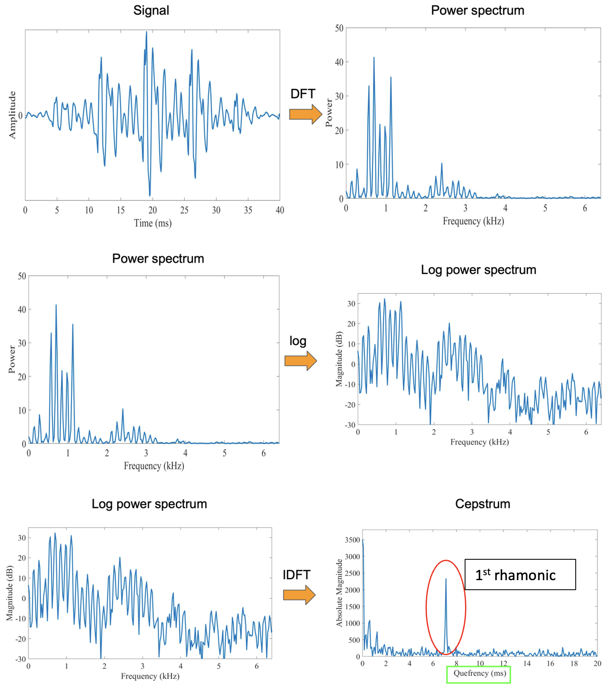
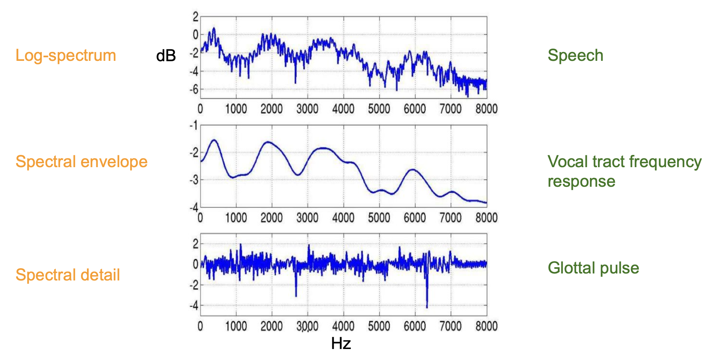
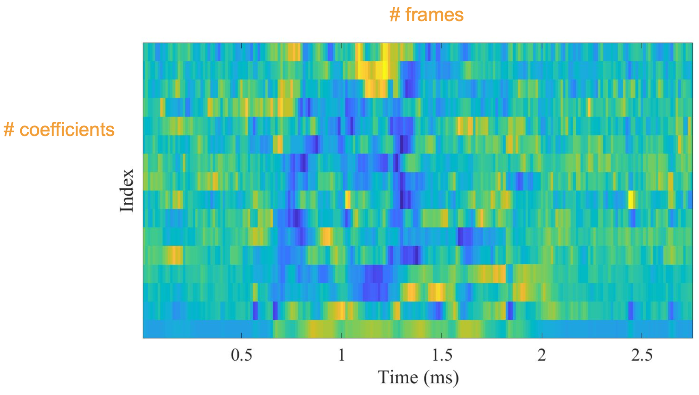

# Mel-Frequency Cepstral Coefficients

- **Ceps**trum ~ **Spec**trum
- **Quef**rency ~ **Freq**uency
- Liftering ~ Filtering
- Rhamonic ~ Harmonic

## Cepstrum

- Formula: $C(x(t)) = F^{-1}[log{F[x(t)]}]$
  - Where:
    - $x(t)$: Time-domain signal (Normal waveform)
    - $F[x(t)]$: Discrete Fourier Transform (Spectrum, i.e move from Time-domain to Frequency-domain)
    - $log{F[x(t)]}$: Log Spectrum
- Explain Cepstrum's Formula
  - 1st rhamonic is the quefrency that associated with the fundamental frequency of the original signal.
  

  
  

### Understanding Cepstrum

- Log-spectrum: speech
- Spectral Envelope: vocal tract frequency response with different formants
  - Formants = Carry identity of sound
- Spectral Detail (Glottal pulse) = Log-spectrum - Spectral Envelope
  

  
  

- **Speech** = Convolution of **Vocal Tract Frequency** response with **Glottal Pulse**
  - The goal for Speech Recognition: Separating components (Vocal Tract & Glottal Pulse) from Speech

## Mel-Frequency Cepstral Coefficients (MFCCs)

- How to compute MFCCs: waveform &#8594; DFT &#8594; Log-Amplitude Spectrum &#8594; Mel-Scaling &#8594; Discrete Cosine Transform &#8594; MFCCs

### How many coefficients are needed ?

- Traditionally: keep first 12 to 13 coefficients
- First coefficients keep most information (e.g, formants, spectral envelope)
- Take 1st and 2nd MFCCs

### Visualising MFCCs

  

  
  

  
- MFCCs are like a matrix
  - Row: cofficients
  - Column: different frames

### MFCCs Advantages & Disadvantages

- Advantages:
  - Describe the “large” structures of the spectrum
  - Ignore fine spectral structures
  - Work well in speech and music processing
- Disadvantages:
  - Not robust to noise
  - Extensive knowledge engineering
  - Not efficient for synthesis

### MFCCs Application

- Speech processing
  - Speech recognition
  - Speaker recognition
- Music processing
  - Music genre classification
  - Mood classification
  - Automatic tagging

## Resources

- [Mel-Frequency Cepstral Coefficients Explained Easily](https://youtu.be/4_SH2nfbQZ8?si=Rgrc6ah241c8HOUy)
