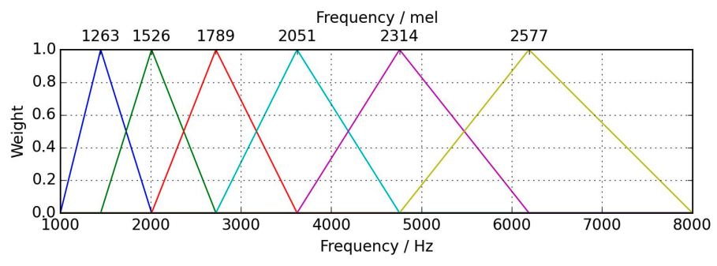

# Mel Spectrogram

- Humans perceive frequency logarithmically &#8594; Mel Scale
- For example:
  - 1st sample: from C2 - C4 -> (65 - 262Hz)
  - 2nd sample: from G6 - A6 -> (1568 - 1760Hz)
  - Although the for both samples, the changing freq are only 200MHz, but we only can few the difference in sound changing from 1st sample, but not with the 2nd sample

## Mel-scale

- The Mel Scale was developed to take this into account by conducting experiments with a large number of listeners.
- It is a scale of pitches, such that each unit is judged by listeners to be equal in pitch distance from the next.
- [READ MORE](../audio-characteristics.md#mel-scale)

   
Mel Scale measures human perception of pitch

## Recipe To Extract Mel Spectrogram

Step 1: Extract STFT.
Step 2: Convert amplitude to DBs.
Step 3: Convert frequencies to Mel scale.

- 3.1. Choose number of **mel bands** (depends on the problem)
- 3.2. Construct **mel filter banks**

  - Convert lowest & highest frequency to Mel
  - Create number of bands equally spaced Mel points as number of mel bands
  - Convert those Mel points back to Hertz
  - Round to nearest frequency bins
  - Create triangular filter

    - x-axis (upper): freq in Mel
    - x-axis (lower): freq in Hz
    - y-axis: weight from 0 and 1.0 (filter, when weight = 1, we wont touch on that signal, when weight < 1, we will dump down the signal)
    - In below example, we have 6 mel bands
      

      
    

    - Mel filter banks'shape: $M = (numberof bands, framesize /2 + 1)$

- 3.3. Apply **mel filter banks** to spectrogram
  - Mel filter banks'shape: $M = (numberof bands, framesize /2 + 1)$
  - Spectrogram: $Y=(framesize /2 + 1, number of frame)$
  - Mel Spectrogram: $MY$

## Mel Spectrogram Application

- Audio classification
- Automatic mood recognition
- Music genre classification
- Music instrument classification
