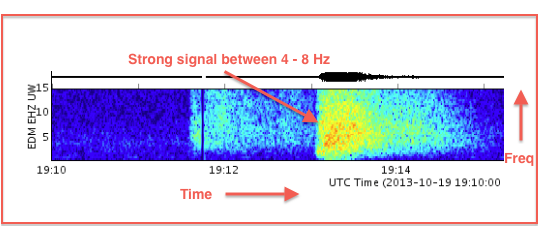
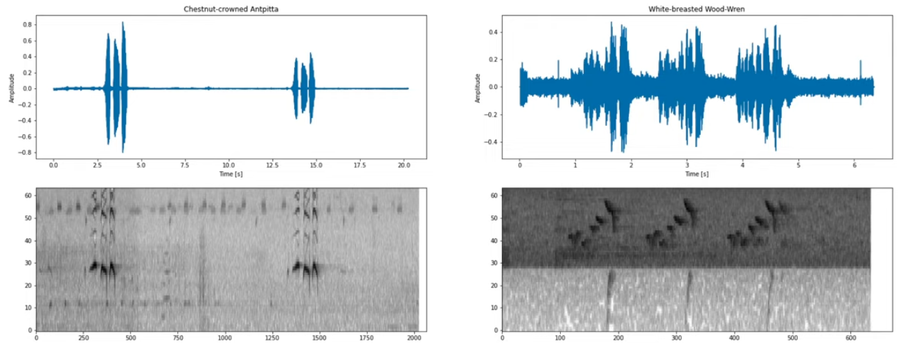

# Introduction to Audio

## What is Sound & Audio ?

### Sound

- Sound has properties: Frequent, Amplitude & Direction
- Sine Wave: $y(t) = A\sin(2 \pi ft + \phi)$

### Audio

- The electronic representation of Sound
- `Audio Frequency`: 20 to 20kHz
- `Sample Rate`: 16kHz, 44.1kHz (take 44,000 samples or measurements per second) &#8594; The more sample per second get, the higher quality captured
- `Waveform`: samples over the time
- `Spectrogram`: a visual way of representing the signal strength, or “loudness”, of a signal over time at **various** frequencies present in a particular waveform.

  - We can convert the **waveform** to **spectrogram** (image) &#8594; can classify sound using the same technique when classifying the images

  

  

  - _x-axis_: time
  - _y-axis_: frequency in Hz
  - _color_: magnitude or amplitude (the brighter the higher in DB)

  

  

## Audio Tasks

### Audio Classification

- Application:
  - **Language Detection**: extremely useful as a preprocessing step for other systems
    - Dataset: [VoxLingua107](https://bark.phon.ioc.ee/voxlingua107/) allows to train language identification models for up to 107 languages.
  - **Command Recognition**: Command recognition or keyword spotting classifies utterances into a predefined set of commands. This is often done on-device for fast response time. - Dataset: Google Speech Commands dataset, given an input, a model can classify which of the following commands the user is typing: `'yes', 'no', 'up', 'down', 'left', 'right', 'on', 'off', 'stop', 'go', 'unknown', 'silence'
`
  - **Speaker Identification**: to classify the audio of the person speaking. Speakers are usually predefined.
    - Dataset: VoxCeleb1
- Metrics: Accuracy, Recall, Precision, F1
- Pre-trained Model:
  - Wav2Vec2
  - [HuBERT](https://huggingface.co/superb/hubert-large-superb-er)

### Automatic Speech Recognition

- Automatic Speech Recognition (ASR), also known as Speech to Text (STT), is the task of transcribing a given audio to text.
- Datasets:

| Dataset      | Hours                        | Source       | Language Support |
| ------------ | ---------------------------- | ------------ | ---------------- |
| Librispeech  | 1000 hours                   | Audio books  | English          |
| Common Voice | >9000 hours                  | Crowdsourced | multi-language   |
| Vox Populi   | 400k hours of unlabeled data |              | multi-language   |

- Application:
  - **Virtual Speech Assistants**: Many edge devices have an embedded virtual assistant to interact with the end users better.
- Metrics: WER (Word Error Rate)
